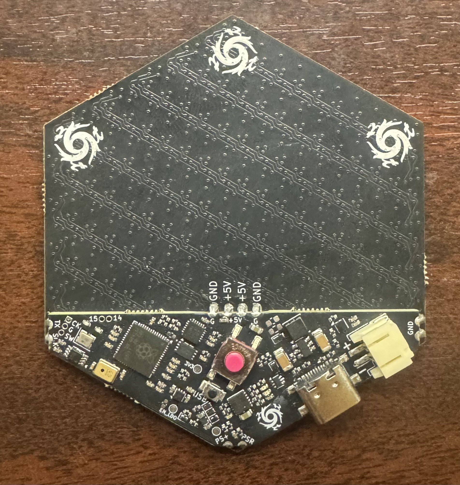
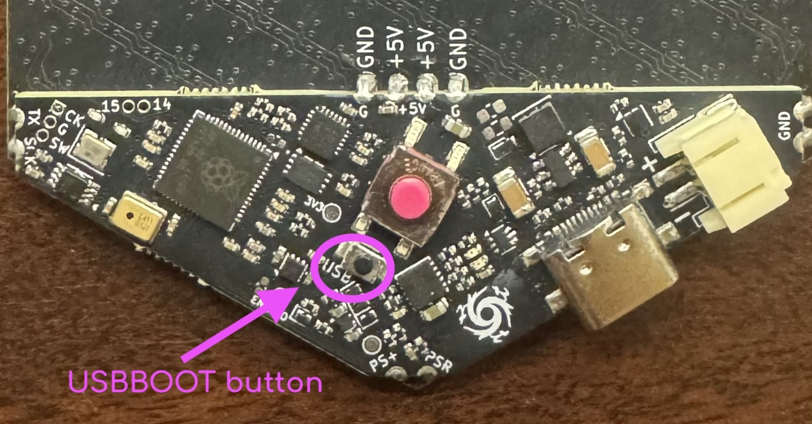

# motionhexa

PCB designs and code for a motion-reactive, battery-powered hexagonal glowy object. 




# The Object

It is a hexagon. Colors swirl & shift as you move it. Pixels fall towards the earth. The triangle stays put. USB-C Rechargable.

## Controls

There is a button on that back of an assembled hexa that you can press by squeezing through the front and back of the case for a single click. 
* Single click: Next Pattern
* Double click: Previous Pattern
* Long (1-second) squeeze: Power on and off
* Very long (10-second) squeeze: Soft reset

## Hardware

* RP2040 dual-core ARM processor
* ICM-20948 motion sensor
* LMD4030 PDM microphone
* BQ27421 battery monitor
* SK9822-EC20 pixels
* LP28013HQVF lipo charger

### Disabled Hardware

* An ALS-PT19-315 ambient light sensor for use in autobrightness that is disabled since its response time is too slow (likely load capacitance too high) to be able to subtract out the the light from nearby pixels during patterns. It may be able to do one-shot autobrigthness during the startup animation.
* An MT3608-based 5V boost circuit. The hexa is running with no color-loss issues directly on lipo voltage, so the boost circuit is disabled.

### Hardware errata

* v5: An issue where the charging ring will remain after unplugging the hexa due to unexpected voltage on the VBUS line. Mitgated in 1e0326c by fully powering off when device is manually turned off.

# Project layout

* hexacontroller/ contains the pcb for the logic, power, and motion circuitry.
* hexa/ contains the pcb for the hexagonal lattice of 271 *SK9822-EC20* pixels wired in zig-zag order
* src/ all project-specific source
* lib/ submodule dependencies *dustlib* and *BQ27427 Battery Fuel Gauge*

The project is built using [PlatformIO] in Visual Studio Code.

## Building

Build the v5 environment in the [PlatformIO] project, which corresponds to the MakerFaire2025 hardware.

You will likely need to run
```
git submodule update --init
```
in the source after ```git clone``` in order to fetch the submodules for building.

### Libraries & Dependencies
PlatformIO should fetch the apprpriate version of each dependency on first build.

* [FastLED] - A library for fast 8-bit math and rendering colors onto pixels
* [SparkFun_ICM-20948] - A library for interfacing with the ICM-20948 Motion sensor
* [edrean/BQ27427 Battery Fuel Gauge] - A library for interfacing with the BQ27421 (very similar to BQ27427) battery monitor (PlatformIO should build against my *BQ27427 Battery Fuel Gauge* fork)
* [dustlib], my work-in-progress pixel library

## How to write patterns

### Please be aware that modifying the code is at your own risk

Pattern code is in [src/patterns.h](https://github.com/starduststorm/motionhexa/blob/main/src/patterns.h)

You can write your own new pattern by subclassing *Pattern*.

```C
class MyAwesomePatternIdea : public Pattern {
public:
  MyAwesomePatternIdea() { }
  void update() {
    // Example 1: Show a rainbow down the zig-zag pixel wiring of the hexa
    for (int px = 0; px < ctx.leds.size(); ++px) {
      CRGB color = CHSV(10 * px - millis()/10, 0xFF, 0xFF);
      ctx.leds[px] = color;
    }

    // Example 2: Show a rainbow pulsing outwards from the center using axial coordinates
    /*
    Axial centerAxial = axial.axialFromPixelIndex(ctx.leds.size()/2);
    for (int px = 0; px < ctx.leds.size(); ++px) {
      Axial ax = axial.axialFromPixelIndex(px);
      // the sum of the differences of q,r,s gives us the "cube distance" which in 2d is shaped like a hexagon
      int distanceToCenter = abs(ax.q() - centerAxial.q()) + abs(ax.r() - centerAxial.r()) + abs(ax.s() - centerAxial.s());
      CRGB color = CHSV(20 * distanceToCenter - millis()/5, 0xFF, 0xFF);
      ctx.leds[px] = color;
    }
    */

    // Example 3: Show a small hexagon that moves around are you tilt the hexa
    /*
    // get the acceleometer reading for this frame, scale it down, then convert it into axial coordinates
    auto acceleration = MotionManager::motionFrame.agmt.acc.axes;
    float accScale = 1000;
    fAxial accOffset = axial.rectToHex(vectorT<float>(acceleration.y/accScale, -acceleration.x/accScale), 1);
    // then get the center pixel axial and offset it by the acceleration axial
    fAxial centerAx = axial.axialFromPixelIndex(ctx.leds.size()/2);
    fAxial circleAx(centerAx.q() + accOffset.q(), centerAx.r() + accOffset.r());
    // finally, draw a small hexagonal shape centered around this point
    float circleSize = 6;
    for (PixelIndex px = 0; px < LED_COUNT; ++px) {
      fAxial ax = axial.axialFromPixelIndex(px);
      float distance = fabs(circleAx.q() - ax.q()) + fabs(circleAx.r() - ax.r()) + fabs(circleAx.s() - ax.s());
      uint8_t brightness = constrain(0xFF - 0xFF * distance/circleSize, 0, 0xFF);
      ctx.leds[px] = CHSV(0,0,brightness);
    }
    */
  }
  const char *description() {
    // This is the name of the pattern that will be printed onto the serial console
    return "MyAwesomePatternIdea";
  }
};

```

Each pattern needs to be added to the pattern list in main.cpp [here](https://github.com/starduststorm/motionhexa/blob/main/src/main.cpp#L304). in order to run.
You can add your own pattern by adding a line to the list where you find *patternManager.registerPattern*.
```
void setup() {
  # ...
  patternManager.registerPattern<MyAwesomePatternIdea>();
  # ...
}
```
This list defines the order that patterns run when you click the button.

### USBBOOT (help my hexa won't boot)

If your hexagon stops doing hexagon things while you are hacking on it, does not respond to power cycle, and you are unable to re-flash it, you can put it into DFU mode using rp2040 USBBOOT.

* Carefully open the case using a flat, blunt tool, avoiding poking the battery. 
* There is a button on the hexacontroller here:
* 

* Press and hold the button while plugging into a computer-attached usb port. You should see a drive (USB Mass Storage Device) appear called "RPI-RP2". 
* You can now either re-flash the hexa yourself using PlatformIO or another tool
OR
* Copy the stable binary hexa image from [here](bin/hexa-v5-firmware@ed502d04.uf2) onto the drive, and after the copy it should automatically reboot.

## Document is a work in progress
(More details to come!)

[FastLED]: https://github.com/FastLED/FastLED
[PlatformIO]: <https://platformio.org>
[SparkFun_ICM-20948]: <https://github.com/sparkfun/SparkFun_ICM-20948_ArduinoLibrary>
[edrean/BQ27427 Battery Fuel Gauge]: <https://github.com/edreanernst/BQ27427_Arduino_Library>
[dustlib]: <https://github.com/starduststorm/dustlib>
